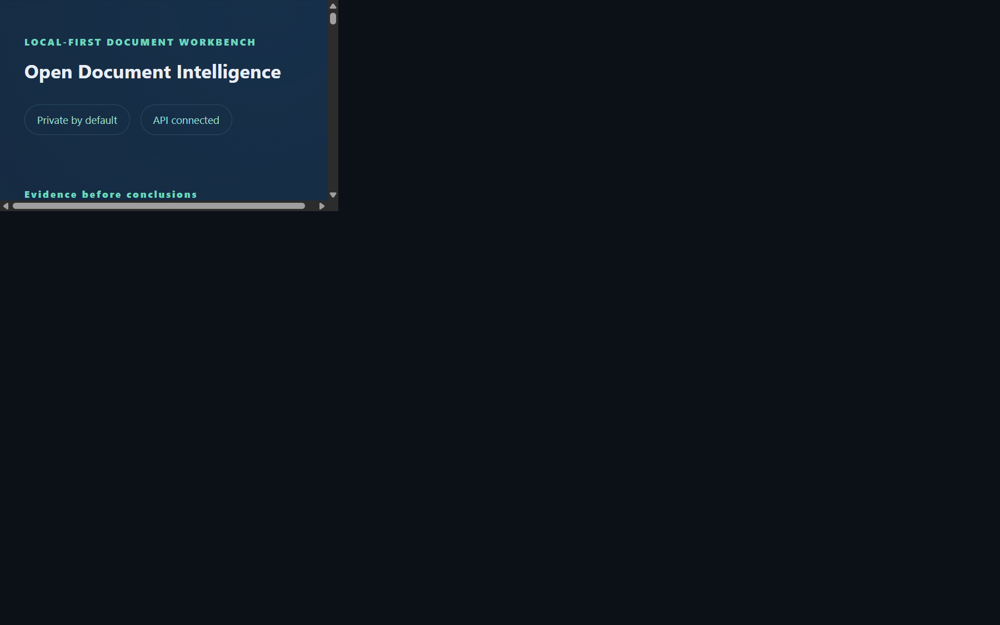
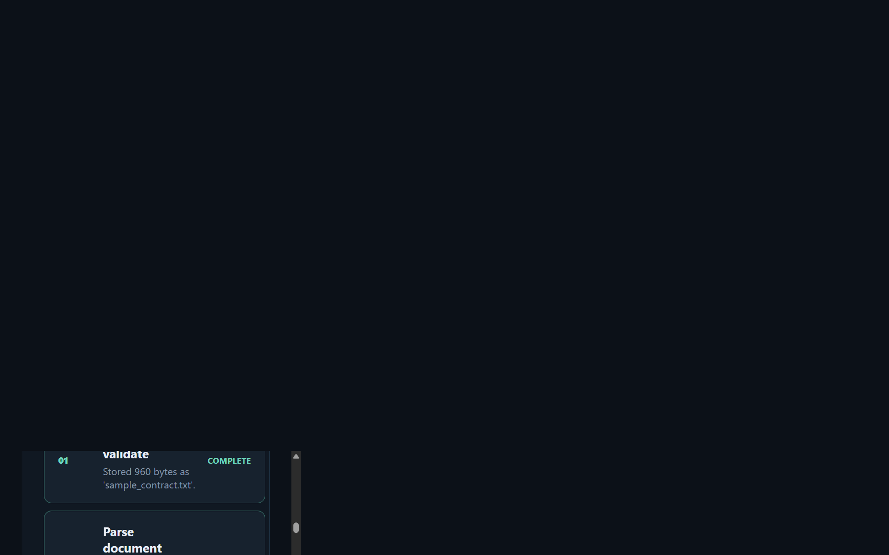
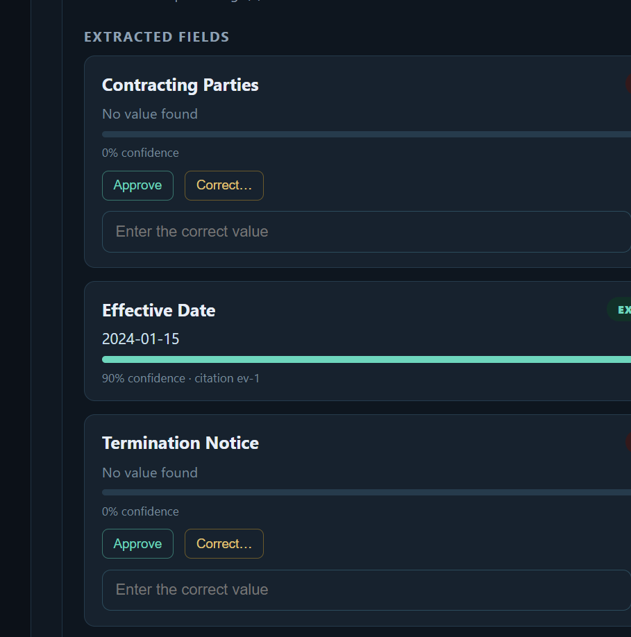
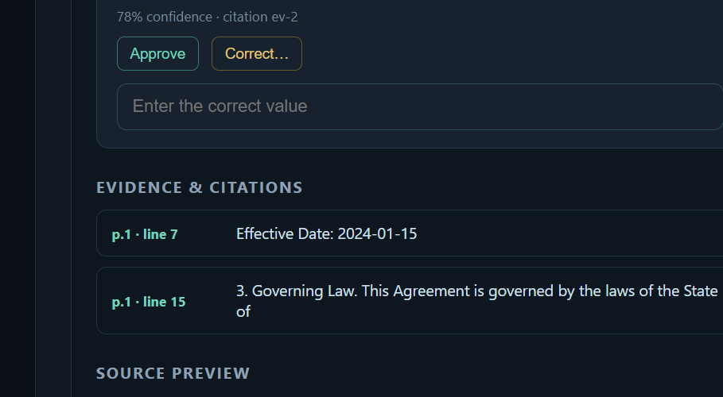
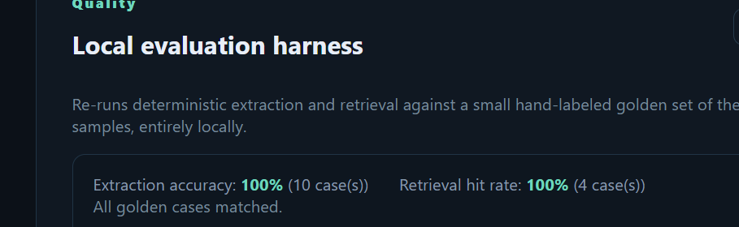

# Open Document Intelligence

A local-first document intelligence workbench for inspecting contracts, policies,
invoices, forms, and operational documents with evidence-backed results.

## Product direction

The platform makes every processing phase visible:

1. Upload and validate
2. Parse text and layout
3. Extract structured fields
4. Retrieve supporting evidence
5. Validate and score confidence
6. Route uncertain results for human review
7. Preserve an auditable history

The first implementation is intentionally provider-neutral. Local parsing, OCR,
embeddings, and language models can be added without changing the API contract.

## See it in action

The web workspace walks every document through the same six-stage pipeline and
keeps humans in the loop for anything the system isn't confident about.

| | |
|---|---|
|  **Private by default.** No document ever leaves your machine — everything runs against a local API with no third-party keys or paid services required. |  **Every phase is visible.** Upload, parsing, field extraction, evidence linking, indexing, and review are reported as discrete, inspectable steps — not a black box. |
|  **Confidence-scored extraction.** Each field shows its confidence, its citation back to the source text, and one-click Approve/Correct actions for human review. |  **Grounded answers with citations.** Ask a question about the document and get an answer backed by page/line citations and a source preview — no unverifiable claims. |
|  **Built-in evaluation.** A local, deterministic evaluation harness scores extraction accuracy and retrieval hit rate against a hand-labeled golden set, entirely offline. | |

## What's implemented

- **Real multipart upload** (`POST /v1/documents`) with extension/size/empty-file
  validation, `.txt`/`.md`/`.csv` decoding, and `.pdf` text extraction via `pypdf`.
- **File-backed persistence**: raw uploads and JSON document records live under
  `apps/api/.data/` (configurable with `ODI_DATA_DIR`) and survive process restarts.
- **A visible processing pipeline** (upload → parsing → extraction → evidence →
  indexing → review) recorded per document, including error/skip states when a
  stage fails, plus an explicit **`ProcessingJob` workflow record**
  (`GET /v1/documents/{id}/workflow`) that honestly reports `mode: "sync"` —
  there is no background job queue, so the API never pretends to offer one.
  Every document's `workflow` field carries the same record inline.
- **Deterministic, regex-based extraction** per document type (contract, invoice,
  policy, form, generic) with a confidence score per field.
- **Evidence & citations**: every extracted value links back to the exact page
  and line it came from.
- **A local vector store for chunk retrieval** (`open_document_intelligence.vectorstore`):
  chunks are embedded and persisted to a SQLite database (`apps/api/.data/vectors.db`,
  stdlib only, no server) during processing (the new `indexing` pipeline stage).
  The default embedder is a deterministic, dependency-free SHA-256 hashing
  bag-of-words embedding — reproducible across machines, no model download.
  An optional `sentence-transformers` backend can be enabled with
  `ODI_EMBEDDING_BACKEND=sentence-transformers` (install the `ml` extra); if it
  isn't installed or fails to load, the app automatically falls back to the
  hashing embedder.
- **Two retrieval/answer endpoints**:
  - `POST /v1/documents/{id}/question` — the original lexical-only Q&A, kept
    for backward compatibility.
  - `POST /v1/documents/{id}/rag` — a RAG endpoint that explicitly separates
    **retrieval evidence** (`evidence`, tagged with `method: "vector"` or
    `"lexical"`) from **generated text** (`answer`, tagged with
    `generation_method: "ollama" | "extractive" | "none"`). Retrieval tries
    vector similarity search first and falls back to lexical term overlap when
    there's no index or no confident vector match. Generation uses a local
    [Ollama](https://ollama.com) server if `ODI_ENABLE_OLLAMA=true` and it is
    reachable; otherwise (or if the request fails for any reason) it falls
    back to a safe extractive generator that only ever quotes retrieved
    evidence, so an answer is never fabricated.
- **Human review workflow** (`POST /v1/documents/{id}/review`) to approve or
  correct low-confidence/missing fields, which updates document status.
- **Optional local OCR for scanned PDFs** (`open_document_intelligence.ocr`):
  when a PDF page has no extractable text but contains an embedded image, the
  parser tries local OCR via [Tesseract](https://github.com/tesseract-ocr/tesseract)
  through `pytesseract` (install the `ocr` extra). OCR is entirely optional and
  local — there is **no silent fallback**: if the engine or its Python
  bindings aren't installed, or the Tesseract binary can't be found, the page
  is reported as `ocr_unavailable` with a specific reason instead of quietly
  returning empty text. Every page is tagged with a `TextSource`
  (`native_text`, `ocr`, `no_text`, `ocr_unavailable`, `ocr_failed`), and each
  document exposes an aggregate `ocr_status` (`not_needed`, `used`,
  `unavailable`, `failed`), `pages_ocr_used`/`pages_needing_ocr`, and an
  `ocr_detail` message. A document that needs OCR but can't get it is routed
  to human review rather than reported as clean. Set `ODI_TESSERACT_CMD` to
  point at a non-standard Tesseract install; on Windows, common install
  locations under `Program Files` are detected automatically.
- **A persisted, append-only audit trail** (`open_document_intelligence.audit`,
  `GET /v1/documents/{id}/audit`): every processing run and every field review
  decision is recorded as an `AuditEvent` (event type, actor, detail,
  timestamp) in its own JSON store (`apps/api/.data/audit.json`), independent
  from the document records, and it survives process restarts.
- **A local evaluation harness** (`open_document_intelligence.evaluation`,
  `GET /v1/evaluation`, or `python -m open_document_intelligence.evaluation`
  as a CLI) that scores extraction accuracy and retrieval hit-rate against a
  small golden dataset built from the bundled samples — useful as a
  regression check when extraction rules or retrieval logic change. The CLI
  prints a JSON report and exits non-zero on any regression.
- **A bundled sample dataset catalog** (`GET /v1/samples`,
  `POST /v1/samples/{id}/ingest`) of synthetic contract/invoice/policy/form
  documents, each declaring a `source` and `license` field (all bundled
  samples are synthetic, CC0-licensed content authored for this project), so
  the workbench is useful with zero setup. The catalog also includes a
  synthetic, image-only scanned PDF (`sample-scanned-notice`) purpose-built to
  demonstrate the OCR path end-to-end.
- **A polished web UI** with upload + drag/drop, sample picker, a live pipeline
  stepper, a document list/detail view, confidence/evidence/review controls,
  an OCR status indicator, an audit trail view, and a "run local evaluation"
  panel.
- **CI** (`.github/workflows/ci.yml`) installs the real `tesseract-ocr` engine
  and runs `ruff check` and `pytest` (exercising the genuine OCR-success path,
  not just mocks) on every push/PR, plus a separate `web-check` job that runs
  `node --check` over the frontend source as a lightweight syntax gate.

## Repository layout

```text
apps/
  api/      FastAPI service and document domain
  web/      Browser workbench (upload, samples, pipeline, review UI)
docs/       Architecture and product notes
```

## Local development

### API

```powershell
cd apps/api
python -m venv .venv
.venv\Scripts\Activate.ps1
pip install -e ".[dev]"
uvicorn open_document_intelligence.main:app --reload
```

The API is available at `http://localhost:8000`, with OpenAPI documentation at
`http://localhost:8000/docs`. Document data is stored under `apps/api/.data/`
by default; set `ODI_DATA_DIR` to use a different location.

Run the test suite and linter from `apps/api`:

```powershell
pytest
ruff check .
```

To exercise the local OCR path (optional), install the extra and a local
Tesseract engine:

```powershell
pip install -e ".[dev,ocr]"
# Windows: winget install --id tesseract-ocr.tesseract
# Debian/Ubuntu: sudo apt-get install -y tesseract-ocr
```

Without the extra/engine installed, OCR-dependent tests and pages are
reported as unavailable (with a clear reason) rather than silently skipped
as successful.

#### Configuration (environment variables)

| Variable | Default | Purpose |
| --- | --- | --- |
| `ODI_DATA_DIR` | `apps/api/.data` | Where documents, raw files, `vectors.db`, and `audit.json` are stored. |
| `ODI_ALLOWED_ORIGINS` | `http://localhost:8080` | Comma-separated CORS allow-list. No wildcard, no credentials, by default. |
| `ODI_EMBEDDING_BACKEND` | `hashing` | Set to `sentence-transformers` to use a semantic embedder if the `ml` extra is installed; falls back to hashing automatically otherwise. |
| `ODI_ENABLE_OLLAMA` | `false` | Set to `true` to let the `/rag` endpoint call a local Ollama server for generation. |
| `ODI_OLLAMA_URL` | `http://localhost:11434` | Base URL of the local Ollama server. |
| `ODI_OLLAMA_MODEL` | `llama3.2` | Ollama model name to use for generation. |
| `ODI_OLLAMA_TIMEOUT_SECONDS` | `5` | Request timeout before falling back to the extractive generator. |
| `ODI_TESSERACT_CMD` | _(auto-detected)_ | Path to the Tesseract binary, for non-standard installs. |

Ollama, `sentence-transformers`, and Tesseract/`pytesseract` are all entirely
optional and local-only — nothing in this project calls a paid or cloud API.

### Web

The UI is a dependency-free browser app that talks to the local API at
`http://localhost:8000` (override with `window.ODI_API_BASE` before
`app.js` loads). Serve the folder with any static file server, e.g.:

```powershell
cd apps/web
python -m http.server 8080
```

Then open `http://localhost:8080` with the API running.

## Principles

- Local-first and no required paid service
- Evidence before generated conclusions
- Explicit uncertainty instead of silent fallback
- Human review for low-confidence results
- Separate raw files, derived artifacts, and audit events
- Public or synthetic documents for demos
- Be honest about what is synchronous vs. asynchronous — no fake job queues

## Status

End-to-end local pipeline implemented: upload/validate, parse (text/PDF, with
optional local OCR for scanned/image-only PDFs and explicit
text-extracted-vs-OCR-needed metadata), deterministic extraction, evidence
citations, chunk indexing into a local vector store, vector-similarity
retrieval with lexical fallback, a RAG endpoint that separates evidence from
generation (optional local Ollama, safe extractive fallback), an explicit
synchronous workflow/job record, a human review loop, a persisted audit
trail, a local evaluation harness for extraction/retrieval regressions, a
sample dataset catalog with license/source metadata, and a full web UI, all
covered by CI (including a real local-OCR success path and a frontend
syntax check).
Future milestones: true background/async processing for large files, and
richer evaluation datasets covering more document types.
